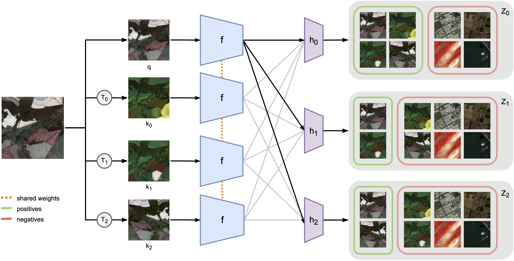

## Seasonal Contrast: Unsupervised Pre-Training from Uncurated Remote Sensing Data



This is the official PyTorch implementation of the [SeCo paper](https://arxiv.org/abs/2103.16607):
```
@article{manas2021seasonal,
  title={Seasonal Contrast: Unsupervised Pre-Training from Uncurated Remote Sensing Data},
  author={Ma{\~n}as, Oscar and Lacoste, Alexandre and Giro-i-Nieto, Xavier and Vazquez, David and Rodriguez, Pau},
  journal={arXiv preprint arXiv:2103.16607},
  year={2021}
}
```


### Preparation

Install Python dependencies by running:
```shell
pip install -r requirements.txt
```


### Data Collection

First, obtain Earth Engine authentication credentials by following the [installation instructions](https://developers.google.com/earth-engine/guides/python_install).

Then, to collect and download a new SeCo dataset from a random set of Earth locations, run:
```shell
python datasets/seco_downloader.py \
  --save_path [folder where data will be downloaded] \
  --num_locations 200000
```


### Unsupervised Pre-training

To do unsupervised pre-training of a ResNet-18 model on the SeCo dataset, run:
```shell
python main_pretrain.py \
  --data_dir datasets/seco_1m --data_mode seco \
  --base_encoder resnet18
```


### Transferring to Downstream Tasks

With a pre-trained SeCo model, to train a supervised linear classifier on 10% of the [BigEarthNet](http://bigearth.net/) training set in a 4-GPU machine, run:
```shell
python main_bigearthnet.py \
  --gpus 4 --accelerator dp --batch_size 1024 \
  --data_dir datasets/bigearthnet --train_frac 0.1 \
  --backbone_type pretrain --ckpt_path checkpoints/seco_resnet18_1m.ckpt \
  --freeze_backbone --learning_rate 1e-3
```

To train a supervised linear classifier on [EuroSAT](https://github.com/phelber/eurosat) from a pre-trained SeCo model, run:
```shell
python main_eurosat.py \
  --data_dir datasets/eurosat \
  --backbone_type pretrain --ckpt_path checkpoints/seco_resnet18_1m.ckpt
```

To train a supervised change detection model on [OSCD](https://rcdaudt.github.io/oscd/) from a pre-trained SeCo model, run:
```shell
python main_oscd.py \
  --data_dir datasets/oscd \
  --backbone_type pretrain --ckpt_path checkpoints/seco_resnet18_1m.ckpt
```


### Datasets

Our collected SeCo datasets can be downloaded as following:

| #images | RGB preview | size    | link | md5 |
| ------- | :---------: | ------- | ---- | --- |
| 100K    | ✓           | 7.3 GB  | [download](https://zenodo.org/record/4728033/files/seco_100k.zip?download=1) | `ebf2d5e03adc6e657f9a69a20ad863e0` |
| ~1M     |             | 36.3 GB | [download](https://zenodo.org/record/4728033/files/seco_1m.zip?download=1)   | `187963d852d4d3ce6637743ec3a4bd9e` |


### Pre-trained Models

Our pre-trained SeCo models can be downloaded as following:

| dataset   | architecture | link | md5 |
| --------- | ------------ | ---- | --- |
| SeCo-100K | ResNet-18    | [download](https://zenodo.org/record/4728033/files/seco_resnet18_100k.ckpt?download=1) | `dcf336be31f6c6b0e77dcb6cc958fca8` |
| SeCo-1M   | ResNet-18    | [download](https://zenodo.org/record/4728033/files/seco_resnet18_1m.ckpt?download=1)   | `53d5c41d0f479bdfd31d6746ad4126db` |
| SeCo-100K | ResNet-50    | [download](https://zenodo.org/record/4728033/files/seco_resnet50_100k.ckpt?download=1) | `9672c303f6334ef816494c13b9d05753` |
| SeCo-1M   | ResNet-50    | [download](https://zenodo.org/record/4728033/files/seco_resnet50_1m.ckpt?download=1)   | `7b09c54aed33c0c988b425c54f4ef948` |